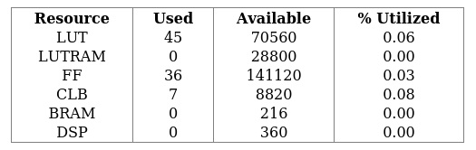
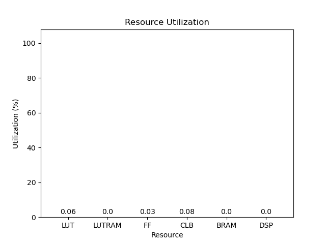
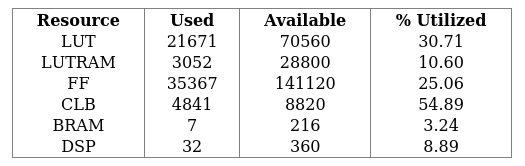
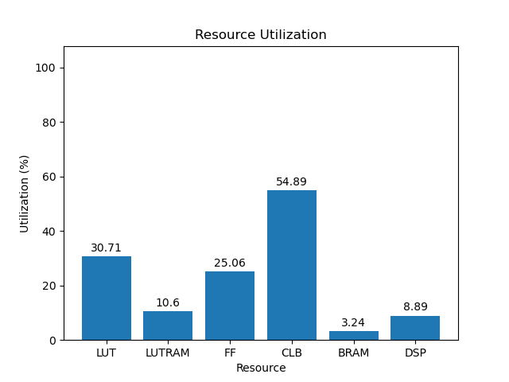
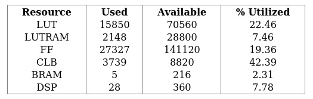
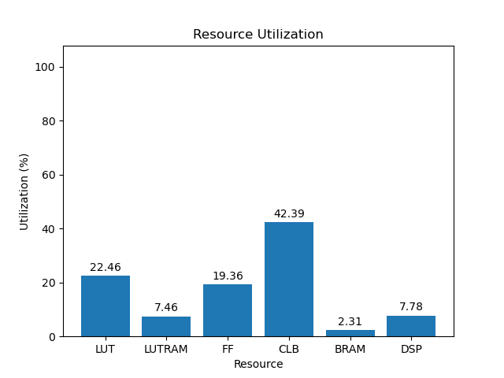

# 3eg

[Back](<../rev4.2.md>)

---

## 5.0
### blank

	

	

`/usr/bin/python ./scripts/gui.py ./utilization/carbon-carp/rev4.2/blank/3eg/5.0/utilization-full.rpt`

### default

	

	

`/usr/bin/python ./scripts/gui.py ./utilization/carbon-carp/rev4.2/default/3eg/5.0/utilization-full.rpt`

### gr-iio

	

	

`/usr/bin/python ./scripts/gui.py ./utilization/carbon-carp/rev4.2/gr-iio/3eg/5.0/utilization-full.rpt`

