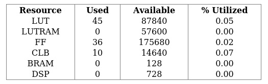
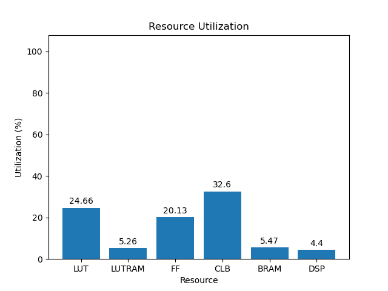
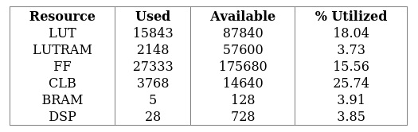
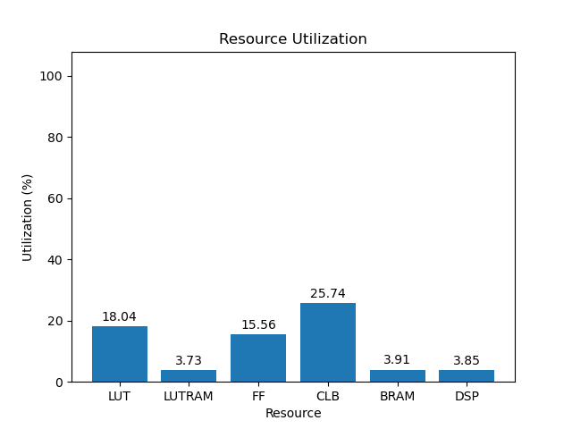

# 4ev

[Back](<../rev4.2.md>)

---

## 3.0
### blank

	

	

`/usr/bin/python ./scripts/gui.py ./utilization/carbon-carp/rev4.2/blank/4ev/3.0/utilization-full.rpt`

### default

	

	

`/usr/bin/python ./scripts/gui.py ./utilization/carbon-carp/rev4.2/default/4ev/3.0/utilization-full.rpt`

### gr-iio

	

	

`/usr/bin/python ./scripts/gui.py ./utilization/carbon-carp/rev4.2/gr-iio/4ev/3.0/utilization-full.rpt`

