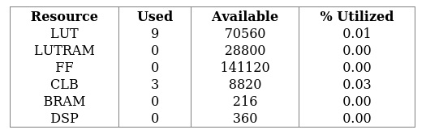
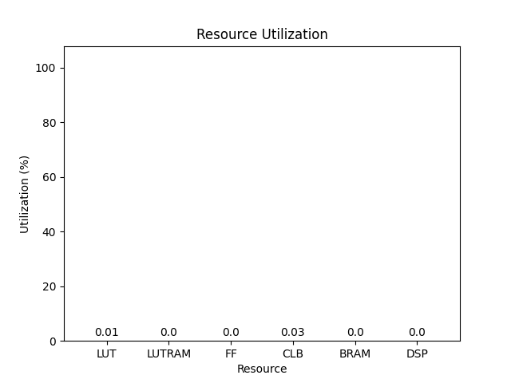
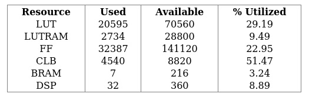
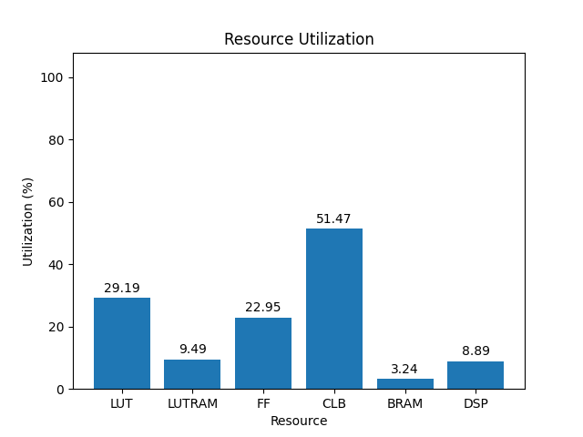
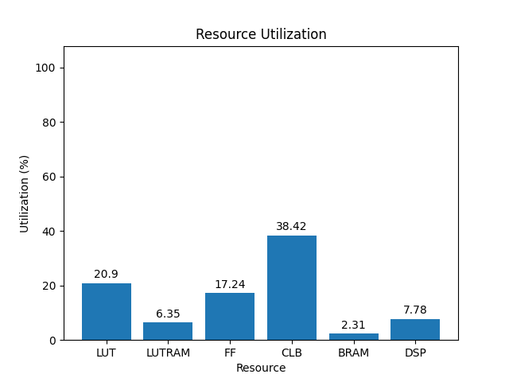

# rev4

[Back](<../carbon.md>)

---

## blank

	

	

`/usr/bin/python ./scripts/gui.py ./utilization/carbon/rev4/blank/3eg/1.0/utilization-full.rpt`

## default

	

	

`/usr/bin/python ./scripts/gui.py ./utilization/carbon/rev4/default/3eg/1.0/utilization-full.rpt`

## gr-iio

	

	

`/usr/bin/python ./scripts/gui.py ./utilization/carbon/rev4/gr-iio/3eg/1.0/utilization-full.rpt`

