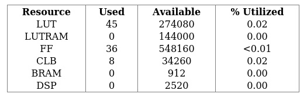
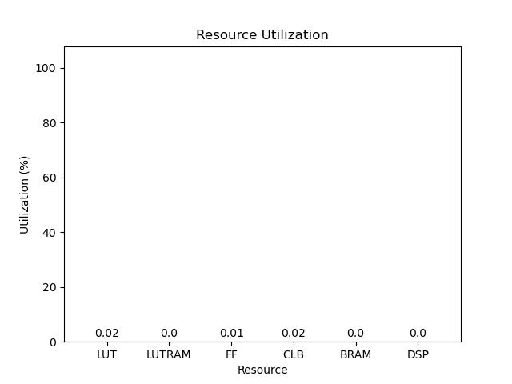
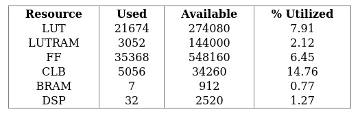
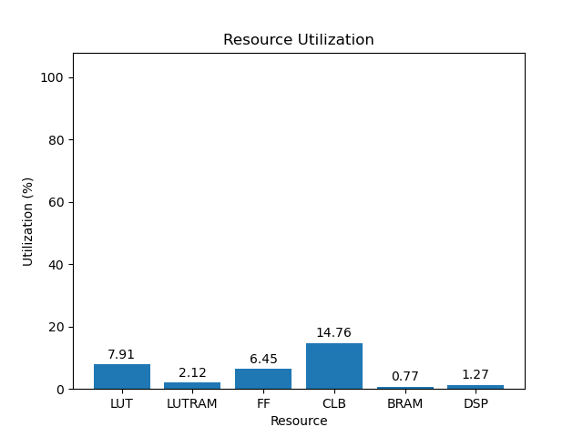
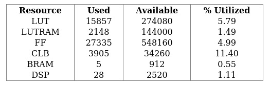
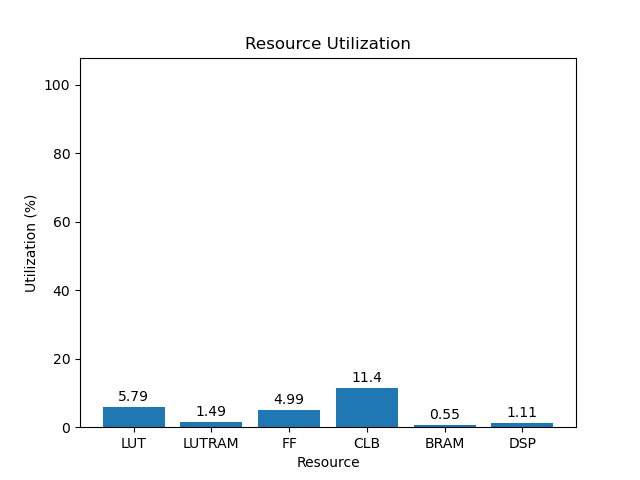

# rev4.2

[Back](<../carbon-carp.md>)

---

## blank

	

	

`/usr/bin/python ./scripts/gui.py ./utilization/carbon-carp/rev4.2/blank/9eg/5.0/utilization-full.rpt`

## default

	

	

`/usr/bin/python ./scripts/gui.py ./utilization/carbon-carp/rev4.2/default/9eg/5.0/utilization-full.rpt`

## gr-iio

	

	

`/usr/bin/python ./scripts/gui.py ./utilization/carbon-carp/rev4.2/gr-iio/9eg/5.0/utilization-full.rpt`

